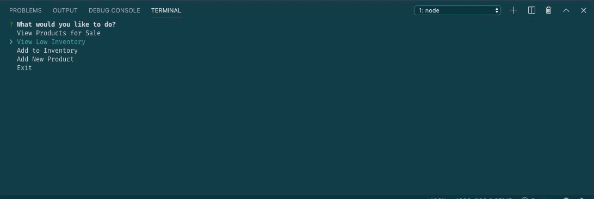

# Bamazon-App

This is a web-app that tracks inventory and simulates shopping through the CLI. It is built in Node.Js and uses a SQL database.

## Technologies Used

  ### Node Modules

  - MySQL for easy querying in Node.
  - Inquirer for taking arguments from the command line.
  - Figlet for holiday themed ASCII art in the command line.

  ###  Database

  - MySQL
  - DBeaver - an open sourced GUI for database management


## How this app works

This app has two JavaScript files (explained below) that can query and manipulate the database when run. 

**Note,** If you plan to clone this, included are the SQL schema and seeds for creating and populating the database.


## Using Bamazon

### Bamazon Customer
This JS file has two main functions; to query the database for departments and allow users to "purchase" those goods.

On execution, it will prompt for a department. Using the answer provided in the inquirer prompt, it will query the database for items that have that department listed.

Once it lists the items, users have the option to "purchase" whatever item they would like by selecting the returned item_id, and providing a number for quantity. If succesful, the app will change the current amount left in the database and return your total spent. If it is unsuccessful due to inventory being low, it will display a message and return to select a department.

The syntax to start the app is:
```javascript
node bamazonCustomer.js
```


### Bamazon Manager

This file has four functions that are selected to run through an inquirer prompt. They are:

1. View all inventory
    - This function will query the database and display everything inside of the products table.

2. View low inventory
    - This function will query the database for any item with a stock quantity lower than 5, and display them in a table.

3. Add to inventory
    - This function will display an inquirer prompt to select an item id, and how many you would like to add to the stock quantity.

4. Add new product
    - This function will display an inquirer prompt that when completed will append a new item to the database. It will ask for a new item id, department name, price, and stock quantity.


